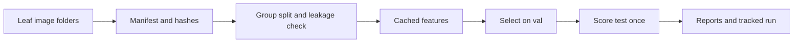
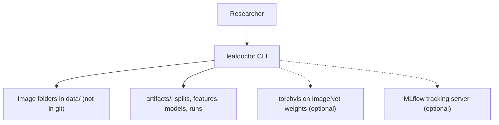
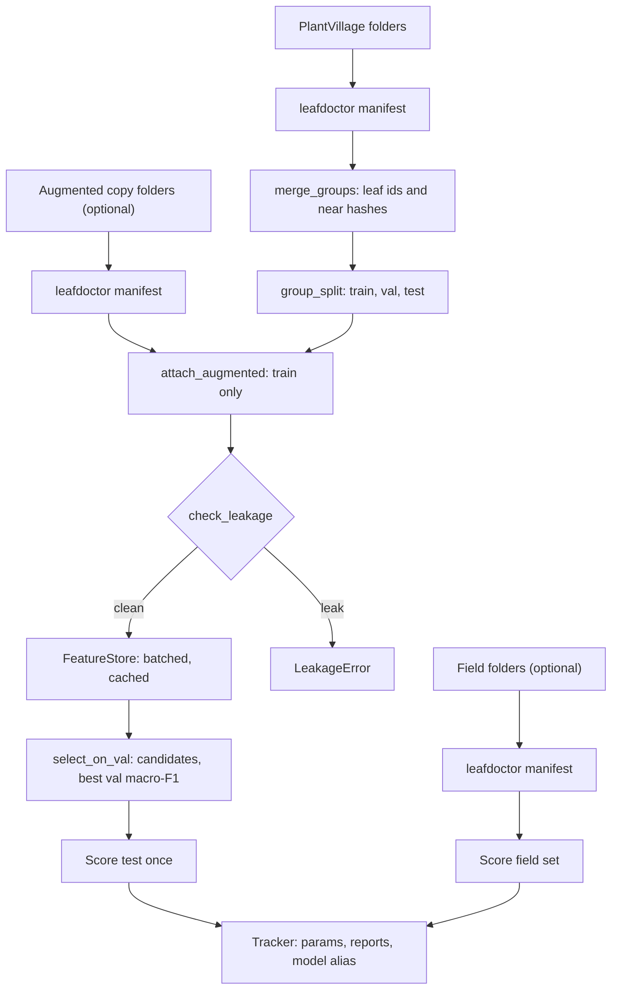

<div align="center">

# leafdoctor — Leakage-Safe Plant Disease Classification with Hybrid Features

**leafdoctor is an image-classification pipeline for plant disease research. It takes folders of leaf images through these steps to a tested classifier and an honest evaluation report:**

`manifest` → `group split` → `cached features` → `select on val` → `score test once` → `score field set`.


**[Summary](#1-summary)** ·
**[Workflow](#4-the-end-to-end-workflow)** ·
**[Run it](#10-how-to-run-leafdoctor)** ·
**[Configuration](#104-environment-variables)** ·
**[Known problems](#13-known-problems)** ·
**[Glossary](#15-glossary)**

</div>

> [!NOTE]
> This README uses ASD-STE100 Simplified Technical English. The writing rules and the project
> vocabulary are in [`docs/ste-style-guide.md`](docs/ste-style-guide.md). Each term in the
> [Glossary](#15-glossary) has only one meaning.

---

leafdoctor classifies leaf images into canonical PlantVillage classes. It joins deep CNN features with handcrafted colour and texture features, and trains a classifier on the cached result.
The main idea is the evaluation protocol. Images of one leaf never go to two splits, the classifier is selected on val only, and the test set is scored once.
An external field test set measures the domain shift from lab photos to field photos.
All tests and the offline demo use synthetic leaf images. They need no download, no GPU and no network.

This README is the **one location that explains all of leafdoctor**. It gives these topics:

- the general design
- each component and its procedure, step by step
- the decision rules
- the data map
- the runbook
- the validation results and the known problems

| If you are… | Read |
|---|---|
| A manager or reviewer | [1](#1-summary), [3](#3-design-rules), [4](#4-the-end-to-end-workflow), [12](#12-validation-results), [14](#14-key-points) |
| A developer who joins the project | All sections, in sequence. Keep [10](#10-how-to-run-leafdoctor) and [13](#13-known-problems) open while you work |
| An operator who runs leafdoctor | [10](#10-how-to-run-leafdoctor), then the section for the component that you use |

---

## Table of contents

1. 🧭 [Summary](#1-summary)
2. 🏗️ [How leafdoctor is built](#2-how-leafdoctor-is-built)
   - 2.1 [Components](#21-components)
   - 2.2 [System context](#22-system-context)
   - 2.3 [Repository layout](#23-repository-layout)
3. 🛡️ [Design rules](#3-design-rules)
4. 🔄 [The end-to-end workflow](#4-the-end-to-end-workflow)
   - 4.1 [Full flow](#41-full-flow)
   - 4.2 [The life cycle of one experiment](#42-the-life-cycle-of-one-experiment)
5. 🔵 [The data layer: manifests and the group split](#5-the-data-layer-manifests-and-the-group-split)
6. 🟢 [The feature layer: extractors and the cache](#6-the-feature-layer-extractors-and-the-cache)
7. 🟣 [The model layer: classifiers, protocol and tracking](#7-the-model-layer-classifiers-protocol-and-tracking)
8. ⚖️ [The decision rules](#8-the-decision-rules)
9. 🗂️ [Data and file map](#9-data-and-file-map)
10. ▶️ [How to run leafdoctor](#10-how-to-run-leafdoctor)
    - 10.1 [Prerequisites](#101-prerequisites) · 10.2 [Installation](#102-installation) · 10.3 [Run leafdoctor](#103-run-leafdoctor) · 10.4 [Environment variables](#104-environment-variables)
11. 🧩 [How to extend leafdoctor](#11-how-to-extend-leafdoctor)
12. ✅ [Validation results](#12-validation-results)
13. ⚠️ [Known problems](#13-known-problems)
14. 📌 [Key points](#14-key-points)
15. 📖 [Glossary](#15-glossary)
16. 📄 [License](#16-license)

---

## 1. Summary

**The problem.** Public leaf-disease datasets contain many photos of the same leaf, and augmented copies of these photos. A random split puts copies of one leaf in train and in val, so the scores go up without a real gain. These questions are difficult:

- How do you find all images of one leaf, also when a copy is flipped, rotated or renamed?
- How do you select a classifier without a look at the test set?
- Do handcrafted colour and texture features add information to CNN features?
- How do you prevent a fabricated or empty number in the experiment tracker?
- How large is the drop from lab photos to field photos?

leafdoctor gives each of these questions its own component. Each component has a validated input and a tested output.

| Item | Value |
|---|---|
| Input | Folders `<root>/<class folder>/<image>` from PlantVillage, an augmented copy (optional) and a field set (optional) |
| Output | Split manifests with a leakage report, a model bundle, val, test and field reports, and one tracked run for each experiment |
| Components | **12** modules: config, classes, images, manifest, split, synthetic, augment, features, models, metrics, tracking, experiment (plus `finetune`, `predict` and `cli`) |
| Feature extractors | `handcrafted` (HSV histogram, GLCM, LBP), `torch:<arch>` (frozen ImageNet CNN, optional), `pixelproj` (offline stand-in) |
| Classifiers | `majority` (baseline), `logreg`, `rf`, `hgb`, `xgb` (optional), and a fine-tuned CNN baseline (optional) |
| Offline mode | Synthetic leaves, `handcrafted` and `pixelproj` features, JSON run files. No key, no download and no network |
| Safety | `check_leakage` stops the split if a leaf group or a near-duplicate image is in two splits |
| Tests | **53** pass in CI (`.[dev]` only) and 4 skip (extras). With PyTorch, 54 pass and 3 skip |



---

## 2. How leafdoctor is built

### 2.1 Components

| Component | Module | Purpose |
|---|---|---|
| Settings | `src/leafdoctor/config.py` | Environment variables, `.env` loader, value checks |
| Class map | `src/leafdoctor/classes.py` | 38 canonical classes and the folder-name harmonisation |
| Images | `src/leafdoctor/images.py` | Image load, HSV conversion, dihedral-invariant difference hash |
| Manifest | `src/leafdoctor/manifest.py` | Folder scan, leaf group ids, schema validation, atomic CSV write |
| Split | `src/leafdoctor/split.py` | Near-duplicate merge, group split, train-only augmented copies, leakage check |
| Synthetic data | `src/leafdoctor/synthetic.py` | Synthetic lab and field leaves for the demo and the tests |
| Augmentation | `src/leafdoctor/augment.py` | Seeded train-time flips, rotations, brightness and noise |
| Handcrafted features | `src/leafdoctor/features/handcrafted.py` | HSV histogram, multi-angle GLCM, rotation-invariant LBP |
| Deep features | `src/leafdoctor/features/backbones.py` | `TorchBackbone`, `PixelProjection`, `Fusion`, `build_extractor` |
| Feature cache | `src/leafdoctor/features/store.py` | Batched extraction and `.npz` cache with a content key |
| Classifiers | `src/leafdoctor/models.py` | scikit-learn pipelines, class weights, `TrainedModel` bundle |
| Metrics | `src/leafdoctor/metrics.py` | Macro-F1 with a bootstrap interval, per-class recall, ECE, confusion |
| Tracking | `src/leafdoctor/tracking.py` | Fixed parameter and metric names, JSON and MLflow trackers |
| Experiment | `src/leafdoctor/experiment.py` | The protocol, the ablation, the leakage comparison |
| CNN baseline | `src/leafdoctor/finetune.py` | End-to-end CNN with class weights (extra `cnn`) |
| Inference | `src/leafdoctor/predict.py` | Batch prediction with a saved model bundle |
| CLI | `src/leafdoctor/cli.py` | The `leafdoctor` command with 10 subcommands |

### 2.2 System context



### 2.3 Repository layout

```
leafdoctor/
├── .github/workflows/ci.yml   # CI: Python 3.11, pip install -e ".[dev]", pytest -q
├── .env.example               # 9 environment variable names, no values
├── pyproject.toml             # package, extras cnn, xgb, mlflow, dev, the leafdoctor script
├── configs/                   # experiment configs in TOML (offline and EfficientNet-B3)
├── data/README.md             # dataset sources, terms, layout, manifest columns
├── docs/ste-style-guide.md    # writing rules and project vocabulary
├── src/leafdoctor/
│   ├── config.py  classes.py  images.py      # settings, class map, image helpers
│   ├── manifest.py  split.py                 # data layer
│   ├── synthetic.py  augment.py              # synthetic leaves, train-time augmentation
│   ├── features/                             # handcrafted.py, backbones.py, store.py
│   ├── models.py  metrics.py  tracking.py    # model layer
│   ├── experiment.py  finetune.py  predict.py
│   └── cli.py                                # command line
└── tests/                                    # 57 tests, no network, no API keys
```

---

## 3. Design rules

### 3.1 One leaf goes to one split
Each image gets a leaf group id from its file name. `merge_groups` also joins images whose canonical hashes are near. `group_split` moves whole groups, and `check_leakage` stops the run if a group or a near-duplicate crosses two splits.

### 3.2 The test set is scored once, after the selection
`select_on_val` receives only the train and val features. `run_experiment` computes the test features after the selection is final. A test asserts that the test images never enter the selection and that the code scores test once.

### 3.3 The augmented copy helps train only
`attach_augmented` adds offline-augmented images to train only. It drops each copy whose leaf group or hash belongs to val or test. Train-time augmentation in `augment.py` changes train images only.

### 3.4 Each fit is on train only
Each classifier is a scikit-learn `Pipeline` with a `StandardScaler`. The pipeline is fit on train, so val and test statistics never enter the scaler. The label encoder is also fit on train.

### 3.5 A metric comes only from an evaluation report
The tracker has no function that logs a free number. `log_eval` reads the headline values of an `EvalReport` and refuses a value that is not finite. The writer and the exporter use the same experiment name and the same key constants.

### 3.6 Each run is reproducible
Each random step takes a seed: the split, the augmentation views, the classifiers, the synthetic generator and the CNN baseline. All paths come from environment variables. No path of a cloud platform is in the code.

### 3.7 Heavy frameworks are optional
The core package needs only NumPy, scikit-learn and Pillow. `torch`, `torchvision`, `xgboost` and `mlflow` are extras, and the code imports them only inside the functions that use them.

---

## 4. The end-to-end workflow

### 4.1 Full flow



### 4.2 The life cycle of one experiment

1. `leafdoctor manifest` scans each class folder and writes one validated row for each image.
2. `leafdoctor split` joins near-duplicates, splits by leaf group and writes `train.csv`, `val.csv` and `test.csv`.
3. The leakage check counts shared groups and near-duplicate pairs across splits. A count above zero stops the command.
4. `leafdoctor train` reads the experiment config and builds the extractor.
5. The feature store extracts train features with augmentation views, and val features without augmentation.
6. Each candidate classifier is fit on train and scored on val. The best val macro-F1 wins.
7. The selected model scores the test split once, then the field set.
8. The tracker writes the parameters, the reports and the model path with the alias `champion`.

---

## 5. The data layer: manifests and the group split

**Purpose.** Change image folders into validated, leakage-free split manifests without a copy of any image.

| Input | Output |
|---|---|
| `<root>/<class folder>/<image>` folders | `manifest.csv` with `path`, `label`, `source`, `group_id`, `phash` |
| One manifest, optional augmented manifest | `splits/train.csv`, `val.csv`, `test.csv`, `split_report.json` |

**Procedure**

1. `canonical_label` compares each folder name by a compact key (lower case, letters and digits only). All 15 PlantVillage folder names map to one of 38 canonical classes.
2. A folder that does not map goes into `unknown_folders`. The scan does not invent a class.
3. `scan_folder` opens each image. A corrupt file goes into `corrupt`, and the scan counts grayscale images.
4. `group_id_from_name` reads the leaf id before `___`, or removes an augmentation suffix such as `_flipLR` or `_270deg`.
5. `canonical_hash` calculates the smallest 64-bit difference hash over the 8 flips and 90-degree rotations of the image.
6. `merge_groups` joins groups with a union-find. Two images join when the Hamming distance of their hashes is at most `--max-distance` (default 3).
7. `group_split` shuffles the groups of each class with the seed. It gives each group to the split with the largest deficit against the target fractions.
8. `write_manifest` writes a temporary file and replaces the target in one step. A new run never keeps stale rows.

**Rules**

- A manifest row must have a canonical label, a non-empty group id, a unique path and an existing file.
- The near-duplicate search uses `max-distance + 1` hash bands. Two hashes within the distance share at least one band, so the search is not quadratic.
- `random_image_split` exists only for the leakage comparison. No command trains a model on it.

---

## 6. The feature layer: extractors and the cache

**Purpose.** Change images into feature matrices once, in batches, and keep them on disk.

| Input | Output |
|---|---|
| Split rows, an extractor spec, an image size, train views, a seed | `FeatureSet` (`X`, `labels`, `paths`, `groups`) and a `.npz` cache file |

**Procedure**

1. `build_extractor` reads a spec such as `handcrafted`, `pixelproj`, `torch:efficientnet_b3` or `torch:efficientnet_b3+handcrafted`.
2. `FeatureStore.features` calculates a cache key from the rows, the file sizes and times, the extractor name, the image size, the views and the seed.
3. If the cache file exists, the store reads it and does not open an image.
4. Otherwise the store loads `LEAFDOCTOR_BATCH_SIZE` images at a time and sends each batch to the extractor.
5. For train, the store adds `train_views` augmented copies of each image. Each copy has its own seeded generator.
6. The store writes the result to a temporary `.npz` file and renames it.

**The handcrafted features (558 values)**

| Part | Values | Detail |
|---|---|---|
| HSV histogram | 512 | 8 x 8 x 8 bins, sum 1 |
| GLCM | 36 | 32 grey levels, distances 1, 2 and 4, angles 0, 45, 90 and 135. Contrast, dissimilarity, homogeneity, energy, correlation and ASM. Mean and range over the angles |
| LBP | 10 | 8 neighbours at radius 1, rotation-invariant uniform codes, sum 1 |

**The deep extractors**

| Spec | Dimension | Needs |
|---|---|---|
| `torch:efficientnet_b3` | 1536 | Extra `cnn`, ImageNet weights download |
| `torch:convnext_tiny` | 768 | Extra `cnn` |
| `torch:resnet50` | 2048 | Extra `cnn` |
| `torch:densenet201` | 1920 | Extra `cnn` |
| `pixelproj` | 128 | Nothing. A seeded random projection of a 16 x 16 thumbnail. It is not a CNN |

---

## 7. The model layer: classifiers, protocol and tracking

**Purpose.** Select one classifier on val, score it once on test and on the field set, and record the run.

| Input | Output |
|---|---|
| Train, val and test feature sets, an `ExperimentConfig` | `RunResult`, `<name>-<run_id>.joblib`, `runs/<experiment>/<run_id>.json` |

**Procedure**

1. `fit_classifier` encodes the labels and fits the pipeline with balanced sample weights (default).
2. `select_on_val` scores each candidate on val and keeps the best macro-F1.
3. `run_experiment` calculates the test features, then scores the selected model on test.
4. If a field manifest is given, the code scores the field rows whose class the model knows.
5. The tracker logs 7 parameters and 5 metrics for each scored split.
6. `TrainedModel.save` writes the pipeline, the classes, the extractor spec and the image size.
7. The tracker records the model with the alias `leafdoctor-classifier@champion`.

**The ablation.** `leafdoctor ablate` runs three experiments that differ only by the feature set: CNN only, handcrafted only, and both. Use it to test the claim that the hybrid features help.

**The CNN baseline.** `leafdoctor finetune` trains a CNN end to end with class-weighted cross-entropy and train-time augmentation. `--arch tiny` is a 3-block CNN that needs only PyTorch. Any torchvision arch in section 6 fine-tunes an ImageNet model.

---

## 8. The decision rules

**Split and leakage**

| Rule | Value | Where |
|---|---|---|
| Split fractions | 0.70 / 0.15 / 0.15 (`--fractions`) | `group_split` |
| Near-duplicate distance | Hamming distance <= 3 of 64 bits (`--max-distance`) | `merge_groups`, `check_leakage` |
| Leakage stop | `shared_groups > 0` or `cross_split_near_duplicates > 0` | `check_leakage` |
| Augmented copy of a val or test leaf | Dropped, counted in `dropped_augmented` | `attach_augmented` |
| Class without an image in a split | Written to `notes` in `split_report.json` | `group_split` |

**Selection and metrics**

| Rule | Value |
|---|---|
| Selection metric | Highest val macro-F1. A tie keeps the first candidate in config order |
| Imbalance policy | `balanced` (default): sample weight = n / (k x class count). `none` turns it off |
| Macro-F1 interval | 95% percentile interval over 200 bootstrap resamples of the scored images |
| ECE | 15 equal-width confidence bins, top label |
| Log loss | Probabilities clipped to `1e-12`, then normalised |

**Tracking vocabulary**

| Kind | Names |
|---|---|
| Parameters | `extractor`, `classifier`, `imbalance`, `train_views`, `seed`, `image_size`, `selected_on` |
| Metrics | `<split>_<name>` for split `val`, `test`, `field` and name `accuracy`, `macro_f1`, `balanced_accuracy`, `log_loss`, `ece` |
| Model alias | `champion` on the registered model `leafdoctor-classifier` |

---

## 9. Data and file map

| Path | Committed? | Contents |
|---|---|---|
| `data/README.md` | Yes | Dataset sources, terms, layout and commands |
| `data/*` | No (git ignores it) | Downloaded image folders |
| `configs/*.toml` | Yes | Experiment configs |
| `.env.example` | Yes | Variable names, no values |
| `.env` | No (git ignores it) | Local settings |
| `artifacts/splits/` | No (git ignores it) | `train.csv`, `val.csv`, `test.csv`, `split_report.json` |
| `artifacts/features/` | No (git ignores it) | `<split>__<extractor>__<key>.npz` feature cache |
| `artifacts/models/` | No (git ignores it) | `<name>-<run_id>.joblib` model bundles |
| `artifacts/runs/<experiment>/` | No (git ignores it) | One JSON file for each run |
| `artifacts/demo/` | No (git ignores it) | Synthetic images, manifests, splits, runs and `demo_summary.json` |
| `mlruns/` | No (git ignores it) | Local MLflow store, if you use `LEAFDOCTOR_TRACKER=mlflow` |

---

## 10. How to run leafdoctor

### 10.1 Prerequisites

| Need | For |
|---|---|
| Python 3.11+ | All components (CI uses 3.11) |
| `numpy`, `scikit-learn`, `pillow` | Core (installed with the package) |
| Extra `cnn` (`torch`, `torchvision`) | `torch:<arch>` features and `leafdoctor finetune` |
| Extra `xgb` (`xgboost`) | The `xgb` classifier |
| Extra `mlflow` (`mlflow`) | `LEAFDOCTOR_TRACKER=mlflow` |

### 10.2 Installation

```bash
git clone https://github.com/KrishnaAnnavaram/leafdoctor.git
cd leafdoctor
python -m venv .venv
. .venv/bin/activate            # Windows: .venv\Scripts\activate
pip install -e ".[dev]"         # add ,cnn or ,xgb or ,mlflow when you need them
cp .env.example .env            # optional: empty values keep the defaults
```

### 10.3 Run leafdoctor

Offline demo (no download, about 25 seconds on a laptop CPU):

```bash
leafdoctor demo --out artifacts/demo
```

Step by step on synthetic images:

```bash
leafdoctor synth --out artifacts/syn --leaves 20 --views 3
leafdoctor synth --out artifacts/syn_field --leaves 6 --views 1 --field
leafdoctor manifest artifacts/syn --source syn --out artifacts/syn.csv
leafdoctor manifest artifacts/syn_field --source synfield --out artifacts/syn_field.csv
leafdoctor split artifacts/syn.csv
leafdoctor train --config configs/hybrid_offline.toml --field artifacts/syn_field.csv
leafdoctor ablate --field artifacts/syn_field.csv
leafdoctor leakage-check artifacts/syn.csv
leafdoctor finetune --arch tiny --epochs 10          # needs the extra cnn
leafdoctor runs --out artifacts/runs.csv
leafdoctor predict artifacts/models/<file>.joblib path/to/leaf.jpg
```

Real data (see [`data/README.md`](data/README.md)):

```bash
pip install -e ".[cnn]"
leafdoctor manifest data/PlantVillage --source plantvillage --out artifacts/pv.csv
leafdoctor manifest "data/New Plant Diseases Dataset(Augmented)/train" --source npdd --out artifacts/npdd.csv
leafdoctor split artifacts/pv.csv --augmented artifacts/npdd.csv
leafdoctor ablate --config configs/hybrid_efficientnet.toml --cnn torch:efficientnet_b3 --field artifacts/plantdoc.csv
```

### 10.4 Environment variables

| Variable | Used by | Meaning |
|---|---|---|
| `LEAFDOCTOR_DATA_DIR` | Settings | Data folder. Default `data` |
| `LEAFDOCTOR_WORK_DIR` | All commands | Output folder for splits, features, models and runs. Default `artifacts` |
| `LEAFDOCTOR_SEED` | Split, train, finetune, demo | Seed. Default `42` |
| `LEAFDOCTOR_IMAGE_SIZE` | `train` without `--config` | Image side in pixels, minimum 32. Default `128` |
| `LEAFDOCTOR_BATCH_SIZE` | Feature store, predict | Images in each batch. Default `32` |
| `LEAFDOCTOR_TRACKER` | Tracking | `json` (default), `mlflow` or `none` |
| `LEAFDOCTOR_EXPERIMENT` | Tracking, `runs` | Experiment name. Default `leafdoctor` |
| `LEAFDOCTOR_DEVICE` | Torch extractors, finetune | `cpu` (default) or a torch device such as `cuda` |
| `MLFLOW_TRACKING_URI` | MLflow tracker | Tracking URI. Empty: the MLflow default |

A bad value (for example a seed that is not an integer) stops the command with `error:`.
Credentials are only in a local `.env` file. Git ignores this file. Do not print or commit credentials.

---

## 11. How to extend leafdoctor

| You want to… | Do this | Code change? |
|---|---|---|
| Use a new dataset with the same class names | Run `manifest` and `split` on its folders | No |
| Map a new folder spelling | Add the compact key to `EXTRA_ALIASES` in `classes.py` | Small |
| Add a CNN backbone | Add a row to `TORCH_ARCHS` in `features/backbones.py` | Small |
| Add a handcrafted feature | Add a function in `features/handcrafted.py` and add it to `HandcraftedExtractor` | Small |
| Add a classifier | Add a branch in `build_classifier` and the name to `CLASSIFIERS` | Small |
| Add a metric | Add it to `EvalReport.headline` and to `METRIC_NAMES` | Small |
| Serve predictions over HTTP | Wrap `predict_paths` in a web framework | Yes |

Planned milestones (not built):

- **M5:** reproduce the hybrid results on PlantVillage with EfficientNet-B3 and report PlantDoc field scores.
- **M6:** LightGBM, a temperature-scaling step for calibration and per-class threshold reports.
- **M7:** an HTTP inference service with a model card.

---

## 12. Validation results

| Validation | Result | Command |
|---|---|---|
| Unit tests | CI installs only `.[dev]`: **53 passed**, 4 skipped (`cnn`, `xgb` and `mlflow` extras). With PyTorch: 54 passed, 3 skipped (torchvision, XGBoost, MLflow) | `pip install -e ".[dev]"`, `pytest -q` |
| Leakage on the synthetic set, image-level split | 60 leaf groups shared by train and val. Val macro-F1 **1.000** | `leafdoctor demo` |
| Leakage on the synthetic set, group split | 0 shared groups. Val macro-F1 **0.908** | `leafdoctor demo` |
| Ablation on synthetic lab test (69 images) | `pixelproj` 0.354, `handcrafted` 0.868, both **0.883** macro-F1 | `leafdoctor demo` |
| Ablation on synthetic field set (36 images) | `pixelproj` 0.092, `handcrafted` 0.337, both **0.389** macro-F1 | `leafdoctor demo` |
| CNN baseline, tiny CNN, 10 epochs, synthetic test | Macro-F1 **0.545** | `leafdoctor finetune --arch tiny --epochs 10` |

All numbers in this table are SYNTHETIC. The demo uses 480 lab images (160 leaves x 3 views, 6 classes, healthy class x3) and 36 field images, with seed 42.
The 95% bootstrap interval of the "both" test macro-F1 is 0.791 to 0.947. Thus the difference between `handcrafted` and both is not significant on this set.
The leakage rows show the effect of the old protocol. The image-level split gives a perfect val score because copies of the same leaf are in train.
The field rows show the size of a domain shift. Lab scores do not predict field scores.
No number on the real PlantVillage or PlantDoc data is reproduced here. The prototype reported validation scores on a leaky split. leafdoctor does not repeat them.

---

## 13. Known problems

Read these problems before you use leafdoctor in production.

| # | Area | Problem | Impact and action |
|---|---|---|---|
| 1 | Results | No result on the real datasets is in this repository or in CI | Run `ablate` with `torch:efficientnet_b3` on your copy of the data |
| 2 | Synthetic data | Synthetic leaves are simple shapes, not plant photos | Use the demo numbers only to check the pipeline |
| 3 | Groups | The leaf id comes from the file name. A dataset without leaf ids in names relies on the hash only | Hashes find flips, 90-degree rotations and light changes. They do not find crops or 30-degree rotations |
| 4 | Groups | A near-hash can join two different leaves. The demo has 3 mixed-label groups | The split stays correct but less balanced. Lower `--max-distance` if many groups mix labels |
| 5 | Field set | Field rows with a class that the model does not know are not scored | Map the field folders to canonical classes before you score them |
| 6 | Calibration | The ECE on the synthetic val set is 0.2 to 0.3 | Do not read probabilities as true chances. Calibration is planned (M6) |
| 7 | Performance | Handcrafted features run in Python for each image, about 2 ms for 64 x 64 | Large real datasets take minutes. The cache makes later runs fast |
| 8 | Weights | `torch:<arch>` downloads ImageNet weights on first use | Prepare the weights cache before an offline run |
| 9 | Model bundles | `joblib` files use pickle | Load only model files that you made |
| 10 | Scope | No HTTP service | Planned (M7). Use `leafdoctor predict` |

**Responsible use.** leafdoctor is a research tool. It is not an agronomic decision tool. An expert must examine a plant before a treatment decision. PlantVillage photos come from a lab with plain backgrounds, and few crops and regions. A model trained on them has a bias toward these conditions.

---

## 14. Key points

1. **One leaf goes to one split.** Leaf ids and dihedral-invariant hashes find copies of one leaf, and `check_leakage` stops a leaky split.
2. **The test set is scored once.** Selection uses val only. The code computes test features after the selection.
3. **The hybrid claim is an ablation.** `ablate` compares CNN only, handcrafted only and both, with bootstrap intervals.
4. **The tracker records only measured values.** There is no free metric call, and the exporter uses the writer keys.
5. **Field data measures the real gap.** A separate field set shows the drop from lab photos to field photos.
6. **The full demo runs offline.** All tests run without network, keys or a GPU.

---

## 15. Glossary

| Term | Meaning |
|---|---|
| **Ablation** | Three runs that differ only by the feature set |
| **Augmented copy** | An image that a dataset author made from another image by a flip, a rotation or a colour change |
| **Canonical class** | One of the 38 class names in `classes.py` |
| **Canonical hash** | The smallest difference hash over the 8 flips and 90-degree rotations of an image |
| **ECE** | Expected calibration error: the weighted gap between confidence and accuracy |
| **Extractor** | A component that changes a batch of images into a feature matrix |
| **Feature set** | The feature matrix, labels, paths and groups of one split |
| **Field set** | Images from real field conditions, used only for the final score |
| **Fusion** | The concatenation of the outputs of several extractors |
| **Leaf group** | All images of one physical leaf, with one `group_id` |
| **Leakage** | A leaf group or a near-duplicate image in two splits |
| **Macro-F1** | The mean of the per-class F1 scores. Each class has the same weight |
| **Manifest** | A CSV file with one validated row for each image |
| **Model bundle** | The saved `TrainedModel`: pipeline, classes, extractor spec and image size |
| **Near-duplicate** | Two images whose canonical hashes differ by at most `max-distance` bits |
| **Run** | One tracked experiment: parameters, reports and a model path |
| **Selection** | The choice of one classifier by val macro-F1 |
| **Split** | The train, val or test part of a manifest |
| **Train view** | One augmented copy of a train image that the feature store makes |

---

## 16. License

[MIT](LICENSE) © 2026 Krishna Annavaram
